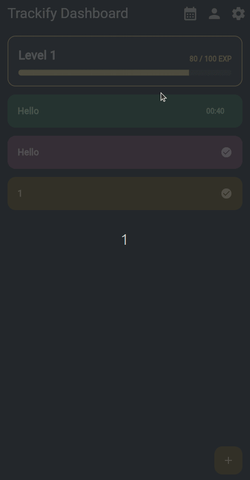
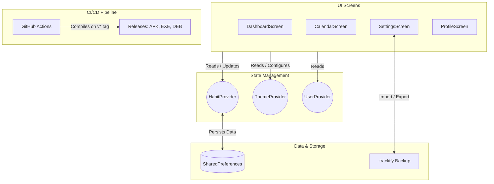

# Trackify

A Flutter habit-tracking application built as a learning project during the **100 Days of Code challenge**. Trackify helps users build and maintain positive habits by providing a clean, intuitive interface to track daily habit completion. It includes a historical **Time Matrix**, a global cooldown timer engine, and an automated multi-platform CI/CD pipeline.

**Download Now:** [https://github.com/North-Abyss/Trackify-Flutter/releases/tag/v0.0.0](https://github.com/North-Abyss/Trackify-Flutter/releases/tag/v0.0.0)

<div align=center>
    
</div>


## Demo Video :
<div align="center" style="display:grid; place-items:center; max-width:760px; margin: 0 auto 1.5rem; padding: 1rem; border: 1px solid #d1d5db; border-radius: 18px; box-shadow: 0 12px 30px rgba(15, 23, 42, 0.08);">
  
</div>

## 📱 Features

- **The Time Matrix** - A historical 10-year calendar that visualizes completion history with custom-colored markers.
- **Habit Dashboard** - View active habits, cooldown timers, streaks, and quick actions in one place.
- **Advanced State Memory** - Habits remember exactly when they were completed, including current streaks and midnight reset behavior.
- **Add/Edit/Delete Habits** - Full CRUD operations for managing habits.
- **Local Storage** - Data is persisted instantly to the device using SharedPreferences.
- **Theme Customization** - Support for custom dynamic themes, accent palettes, and Material You-style color selection.
- **Import / Export Backup** - Save and restore habit data as a custom `.trackify` file directly from the Settings screen.
- **Cloud CI/CD Pipeline** - Automated GitHub Actions release builds for Android, Windows, and Linux on every `v*` tag.

## 🏗️ Architecture

Trackify follows a clean architecture pattern with a clear separation of concerns.

### State Management
- **Provider** (`provider: ^6.1.5+1`) - Used for reactive state management.
  - `HabitProvider` - The universal heartbeat engine. Handles CRUD, streak logic, cooldown timers, persistence, import/export, and historical completion tracking.
  - `ThemeProvider` - Handles theme mode switching, accent colors, and custom theme loading.
  - `UserProvider` - Tracks user progression and XP-style interactions from the dashboard.

### Data & UI Integrations
- **Table Calendar** (`table_calendar: ^3.2.0`) - Renders the historical Time Matrix and dynamic completion dots.
- **SharedPreferences** (`shared_preferences: ^2.5.5`) - Local device storage for habits and metadata.
- **UUID** (`uuid: ^4.5.3`) - Generates unique identifiers for habits.
- **Dynamic Color** (`dynamic_color: ^1.8.1`) - Supports Material You-style dynamic theming when available.
- **File Picker** (`file_picker: ^11.0.2`) - Native `.trackify` import/export UI for backups.
- **Flutter Launcher Icons** (`flutter_launcher_icons: ^0.14.4`) - Generates cross-platform app icons.

### Key Components

#### Models (`lib/models/`)
- `Habit` - Core habit model with built-in memory for `completedDates`, `currentStreak`, cooldown timing, and metadata.
- `UserProfile` - User information and preference model.

#### Screens (`lib/screens/`)
- `DashboardScreen` - Main habit list, create/edit dialog, timer overview, and navigation to the calendar/settings/profile views.
- `CalendarScreen` - The Time Matrix historical view powered by `table_calendar`.
- `ProfileScreen` - User profile summary and related app interactions.
- `SettingsScreen` - Theme, data backup, and `.trackify` import/export controls.

#### Widgets (`lib/widgets/`)
- `HabitCard` - Reusable habit card UI for the dashboard.
- `LevelProgressBar` - Visual progress indicator for user progression.

## 🚀 Getting Started

### Prerequisites
- Flutter SDK (version `3.8.1` or higher)
- A connected device or emulator

### Installation

1. Clone the repository:
```bash
git clone https://github.com/North-Abyss/Trackify-Flutter.git
cd Trackify-Flutter
```

2. Get dependencies:
```bash
flutter pub get
```

3. Run the app locally:
```bash
flutter run
```

4. Run the app specific devices:
```bash
flutter run -d <deviceId>
# e.g.
flutter run -d emulator-5554          # Android emulator
flutter run -d 0123456789ABCDEF       # physical Android device serial
flutter run -d chrome --web-port=8080 # web (Chrome)
flutter run -d linux                  # Linux desktop
flutter run -d windows                # Windows desktop
flutter run -d macos                  # macOS (must run on macOS host)
```

## ☁️ Cloud Compilation (CI/CD)

Trackify ships with a fully automated release workflow in `.github/workflows/release.yml`.

By pushing a `v*` tag, GitHub Actions builds and uploads:

- **Android:** Universal APK and split APKs for ABI-specific installation.
- **Windows:** Native `.exe` installer and portable `.zip` bundle.
- **Linux:** Native `.deb` package and portable `.zip` archive.

The `./git-sync.sh` helper can be used to sync your local branch with GitHub and trigger the release pipeline.

## 📂 Project Structure

```text
lib/
├── main.dart                 # App entry point with MultiProvider setup
├── models/
│   ├── habit.dart           # Habit model with JSON serialization and completion history
│   └── user_profile.dart    # User profile model
├── providers/
│   ├── habit_provider.dart  # Habit state management, timers, streaks, and persistence
│   ├── theme_provider.dart  # Theme mode and accent palette management
│   └── user_provider.dart   # User progress and XP interactions
├── screens/
│   ├── dashboard_screen.dart    # Main habit dashboard
│   ├── calendar_screen.dart     # The Time Matrix
│   ├── profile_screen.dart      # User profile
│   └── settings_screen.dart     # App settings and backup management
└── widgets/
    ├── habit_card.dart        # Reusable habit card component
    └── level_progress_bar.dart # Progress visualization

assets/
├── custom_theme.json        # Custom theme configuration
├── icon.png                 # Base app icon
└── social preview.png       # Social preview image

.github/workflows/
└── release.yml              # Multi-platform cloud compiler instructions
```

## 💡 Learning Highlights

This project demonstrates:

- ✅ **DevOps & CI/CD:** Automated multi-platform release builds via GitHub Actions.
- ✅ **Advanced State Management:** Global timer coordination and reactive UI updates through Provider.
- ✅ **Data Structures:** Historical `DateTime` tracking and streak computation.
- ✅ **Persistent Storage:** SharedPreferences-backed local persistence and JSON backup/import.
- ✅ **Cross-Platform Nuances:** Windows, Linux, and Android build considerations with packaging and asset generation.
- ✅ **Dynamic Theming:** Material You-inspired color selection and theme mode support.

## 📝 Recent Updates

- **The Time Matrix:** Added historical habit completion tracking with `table_calendar` and dynamic colored markers.
- **Cloud Compiler:** Added a GitHub Actions release pipeline for Android APKs, Windows installers, and Linux `.deb` packages.
- **Import / Export:** Added `.trackify` backup workflows directly from the Settings screen.
- **Dynamic Theme Support:** Added Material You-style dynamic colors and curated accent palettes.

## �️ Project Architecture

The diagram below shows how Trackify is structured, how screens talk to providers, and where persistence and backups take place.



## 📝 Future Enhancements

* [x] Streak tracking
* [x] Habit completion history (Time Matrix)
* [x] Export / Import habit data (Custom `.trackify` format)
* [x] Theme mode and accent color customization
* [x] OTA GitHub Update Checker
* [ ] Habit statistics and progress charts
* [ ] Daily reminders and notifications
* [ ] Cloud sync across devices

## 👤 About

This is a learning project created by **@North-Abyss** as part of the 100 Days of Code challenge to master Flutter and DevOps fundamentals.

## 📄 License

This project is open source and available under the MIT License.

---

**Happy tracking! 🚀**
